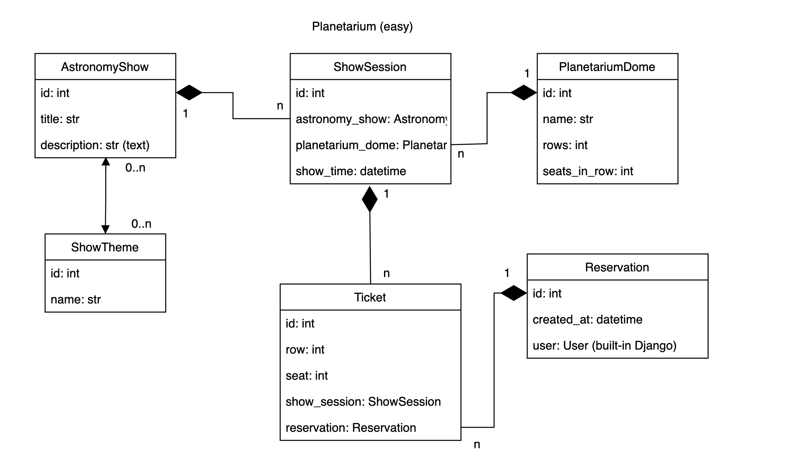

# Planetarium api service

## Installation

Installing using GitHub 

git clone https://github.com/Familenko/planetarium_api_service.git

Install PostgresSQL and create db
```
cd planetarium_api_service
python -m venv venv 
source venv/bin/activate 
pip install -r requirements.txt 

set DB_HOST=<your db hostname> 
set DB_NAME=<your db name> 
set DB_USER=<your db username> 
set DB_PASSWORD=<your db user password> 
set SECRET_KEY=<your secret key> 

python manage.py migrate
python manage-py runserver
```

Run with docker

Docker should be installed 

```
docker-compose build
docker-compose up
```
Getting access
```
• create user via /api/user/register/
• get access token via /api/user/token/
```

## API description

API for planetarium service

## Features

• JWT authenticated

• Admin panel /admin/

• Documentation is located at /api/doc/swagger/

• Managing orders and tickets

• Filtering shows


